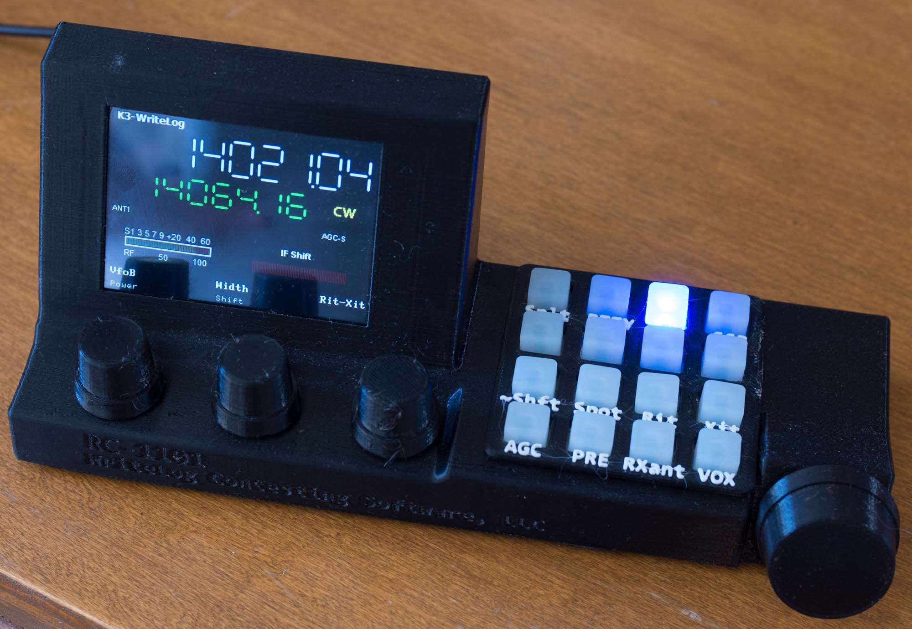
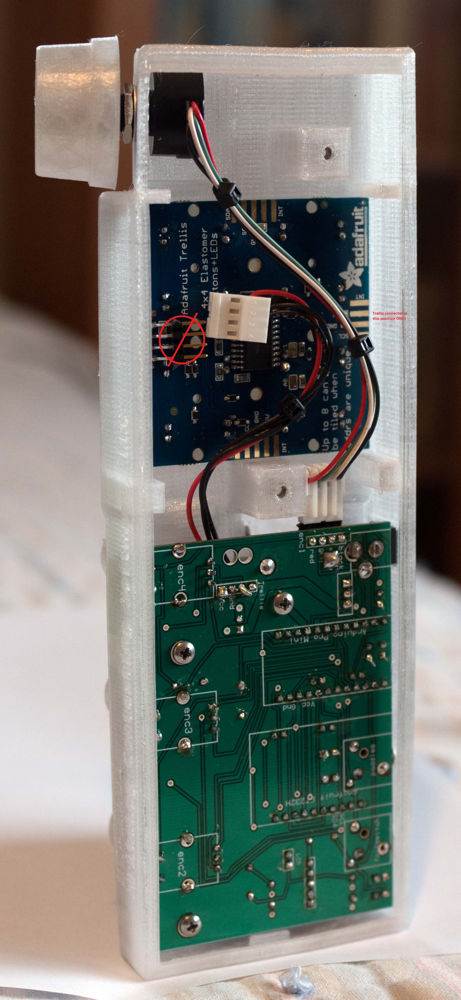

# RC1101
remote control box to add knobs and switches to a PC via USB

3D printed in black and running on an Elecraft K3 remote.

3D printed using "transparent" PETG.

This is a build-it-yourself device that WriteLog can use at its control site 
to remote control rigs at your WriteLog-equipped home station.

Documentation is published here to enable you to:
<ul>
  <li>Fabricate a printed circuit board.</li>
  <li>3D print an enclosure (in three parts.) </li>
  <li>Parts lists for the remaining, commercially available parts.
  <li>Programming information for its Arduino microprocessor.</li>
  <li>Programming information for its LCD display.
</ul>

<h3>Printed circuit board</h3>
The layout for the two-layer PCB was done using <a href='http://expresspcb.com'>expresspcb.com</a>.
The file is <a href='WlRemote.rrb'>here</a>.
There are also gerber files <a href='gerber/'>here</a>.

<h3>Enclosure</h3>
The enclosure was designed using <a href='http://solidworks.com'>Solidworks</a>. 
The Solidworks files are <a href='CAD/'>here</a>.

You don't need Solidworks to print it. The STL files are enough and are
published <a href='STL/'>here</a>. Details about how to print
an enclosure are <a href='enclosure.md'>here</a>.

<h3>Parts List</h3>
The parts, except for the PCB and the enclosure, are available at digikey. 
See a PDF of the parts <a href='partslist.pdf'>here</a>. Or link to
the digikey shared shopping cart from <a href='partslist.md'>here</a>.

<h3>Arduino programming</h3>a
The device requires the <a href='https://www.sparkfun.com/products/11113'>SparkFun Pro Mini at 5V</a>.
The Arduino sketch is <a href='sketch/RC1101'>here</a>.

<h3>uLCD-32PTU programming</h3>
The 3.2" LCD screen is programmable. The programming information is <a href='4D/'>here</a>.

<h3>Other</h3>
<a href='WlRemoteCircuit.pdf'>Here</a> is the circuit diagram.

Should you want to use this device without WriteLog, you're going to need
to have some programming on the PC-side of the USB connection to the
RC-1101. <a href='PC/'>Here</a> is an example of a .NET program 
for Windows that can access the RC-1101. It uses the libraries
available from <a href='http://ftdichip.com'>ftdichip.com</a>.
