<h3>Parts List</h3>
You are reading the documentation for design that uses the gen4 display device, the gen4-uLCD-32PT. Switch git branches if you have the 
older uLCD-32PTU device because
it has different mounting dimensions and therefore different STL files to print an enclosure.
The parts to build this device, except for the PCB and the enclosure and the machine screws and nuts, 
are available at digikey. See a PDF of the parts <a href='partslist.pdf'>here</a>. Or link to the digikey shared shopping cart from 
<a href='https://www.digikey.com/short/z84fb8'>here</a>.

Note that the specified female headers have a 0.29 inch insulation height. This, combined with the 0.10 inch insulation height
on the matching male header, is a critical dimension
for the Adafruit FT232H breakout board. The USB port on that board will not line up with its matching hole in the enclosure otherwise.
Also note that Adafruit has put their same part number, 2264, on both an older version of the board with a micro-USB connector,
and a newer version with a USB-C connector. Both the old and new Adafruit boards will fit this PCB and 
enclosure, but of course you'll need a different cable.

<h3>Construction hints</h3>

Fully assemble the two printed circuit boards. 

The custom 3.5 inch by 2.8 inch printed circuit board is all through-hole components. We don't
offer step-by-step kit instructions, but here is an order of assembly that accommodates being able to
place the through-hole components and solder them without them falling out (much). The photos
below do not exactly match the order the text describes installing the components. The order is not
critical, except that taller components should be installed later, and the resistors and capacitors
can be installed almost any time without interference with other components.

<ul>
<li>Instructions for the Adafruit Trellis are
<a href='https://learn.adafruit.com/adafruit-trellis-diy-open-source-led-keypad/adding-leds'>here</a>.</li>
<li>Add the right angle 4 pin SMD header. There is only one position it
will fit in the enclosure.

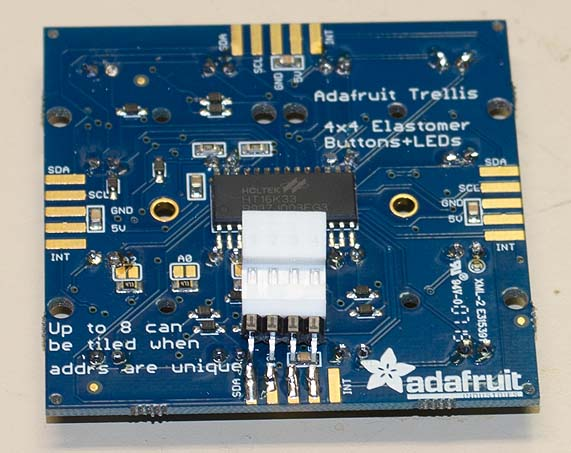

Temporarily place the 4-pin connector as a spacer to ensure you have room to install it later.

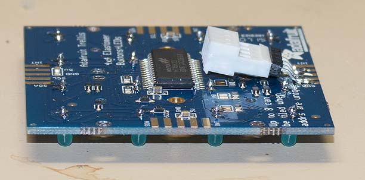

 </li>
<li>Smallest parts go on the PCB first.

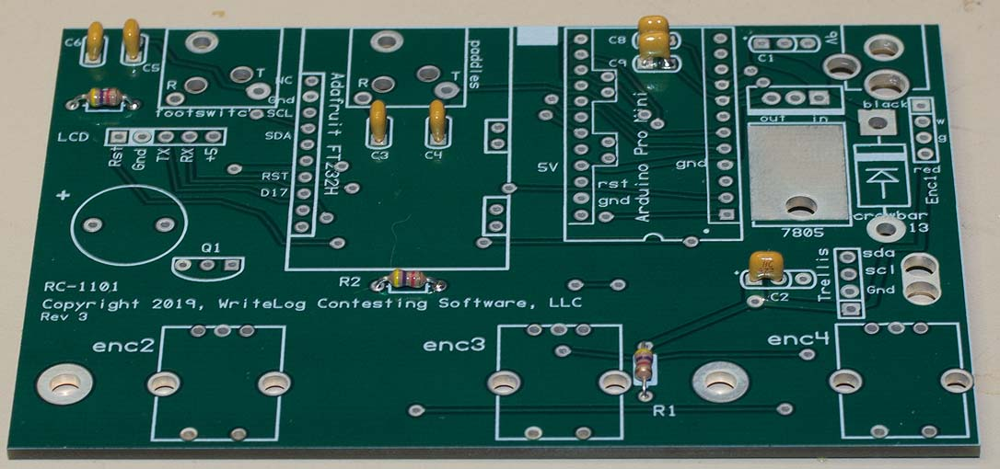
</li>
<li>Install a right angle male header at enc-1. The pins extend out beyond the edge of the PCB.
	<li>the two 1/8" mini jacks, J2 and J2.

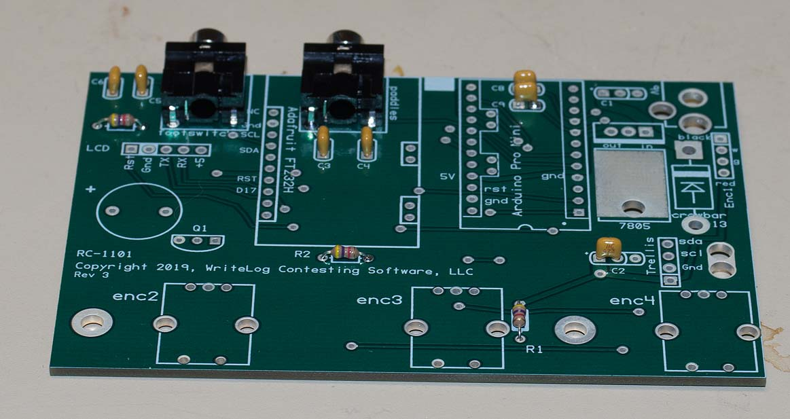
</li>
	<li>Assemble the two 12 pin, .1" centered female connection headers for U2, and their corresponding
       12 pin male connection headers. Don't solder yet.
       <li>Add the two 2 pin headers, both male and female, for the A6/A7 and SDA/SCL pins for U1.
       <li>Solder <i><b>only</b></i> the four corner pins (D1, D9, D10 and RAW) on both the top of the Arduino board
and the bottom of the PCB. double check that all pins are aligned and pushed all the way in. 
Triple check. Its much more difficult to correct errors after this.
<li>Now solder all U2 pins on the top of the Arduino and the bottom of the PCB.
</li>
<li>With the Arduino pulled out of its PCB socket, install a right angle male 6 pin programming header. 
<b>Important:</b> The header <b><i>must hang from the bottom of the Arduino board</i></b>. It will not clear the enclosure if mounted on top.
<li>Cut the headers for the RS232H part to the approppriate number of pins, both the socket side and the pin side. Confirm you have the 
right size. The total offset of the RS232H from the PCB must be 0.390 inches (25/64 inches, or 9.9mm)

</li>
<li>Use a similar procedure for installing the headers U1 as you did for U2 above. It has 10 pin headers--a female and a male--and has to be soldered
on top of the Adafruit FT232H board and on the bottom of the PCB. Solder the four corners first.
Double check that all the pins are populated and pushed all the way in.
<li>triple check. you won't get another chance. Now solder all the pins for U1.
<li>Pull the Arduino and the FT232H boards and set them aside while working on the remainder.

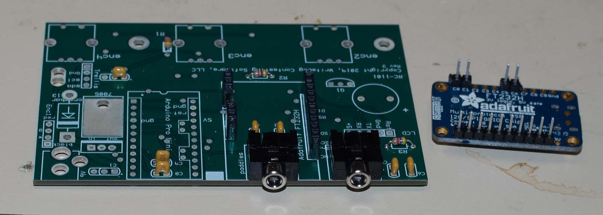
<li>Install a female header at J5 (5 pins) 
<li>Install the buzzer/sounder. Observe the PLUS pin! It will be destroyed if its backwards.
<li>Install the J15 power jack.
<li>U14 has 3 leads that extend through the board and its TO-220 package <b>must</b> be bent over 
with the hole on its tab matching the hole in the PCB. It dissipates about 2W and will 
overheat if not bonded properly to the PCB.
<li>put a very small dot of heat sink grease on U14 to thermally bond it to the matching PCB
area with no solder mask.
<li>Fasten it with a 4-40x1/4" screw and #4 nut. Assemble the nut on the bottom of the PCB to save yourself trouble later
when you need to avoid confusing it with the screws that hold the PCB in the enclosure. 
<li>All the resistors R1 through R3 are the same value, 4.7K
<li>The power supply has the large diode D13, the polarized 1.0 uF capacitor C1 and the 5V output, 0.047 uF, C2.
<li>C3, C4, C5, C6, C8, C9 are all .001uF
<li>Rev 3 of the PCB has the flat side of Q1 silkscreened incorrectly.

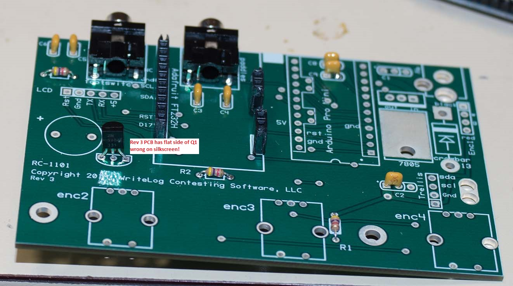

Install the 2N3904 at Q1. REV3 of the PCB has the silk screen flat backwards! The collector goes in the square pin.
<li>Install a 4 pin female connector on the leads from the panel mount optical encoder.
Observe the color designations on the PCB. The black wire goes into pin 1.
Don't shorten the encoder wires. Press their
stripped ends into the connector housing. The best tool is <a href='https://www.digikey.com/short/zjvqw2'>this one</a>. Or use a small allen key or similar tool.
<li>Solder 4 wires of about 4 inches length and 24 gauge in the J4 holes labeled Trellis.
I use three wires the same color and a distinct color for VCC.  
<li>Assemble the 4 wires from J4 into a 4 pin female header. Maintain the same order as on
the PCB. Pin 1 on the header (use a magnifying glass) is the 5V pin.
<li>Use two nylon cable ties to bind the 4 wires together on each of the 4-wire harnesses:
the one to the
Trellis and the one to the panel mount encoder.
<li>Install the 3 PCB mount encoders. solder all the pins. There will be significant
force trying to pull these back out of the board in the future if and when it becomes necessary to remove
the knobs pressed on them. 
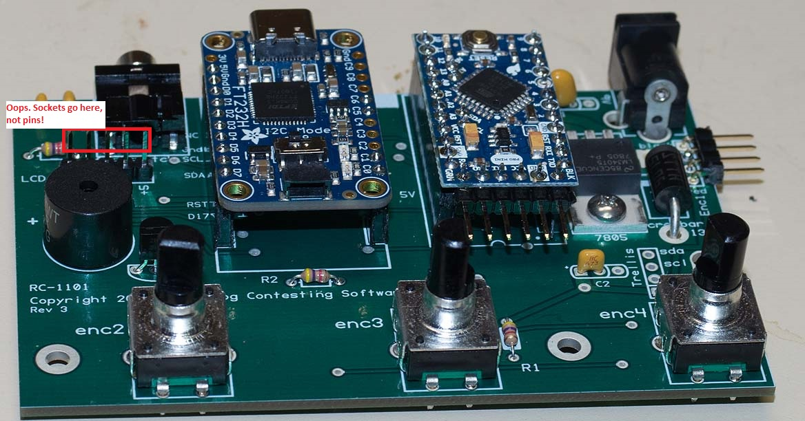

<li>Assemble the LCD display. The FFC cable connectors on the 4D systems parts are very small. Look at the photo carefully. 
The RC-1101 needs the gen4-IB 
(interface board) installed both for programming and to install the RC-1101. Get it
on that FFC cable and it can stay there.
The locking tab slides towards the "gen4 Display" logo to unlock.

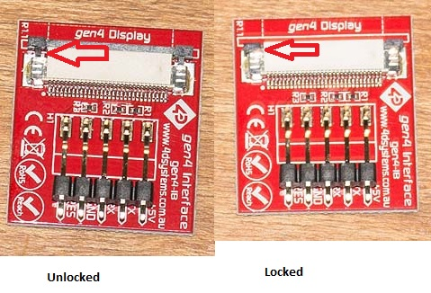
</li>

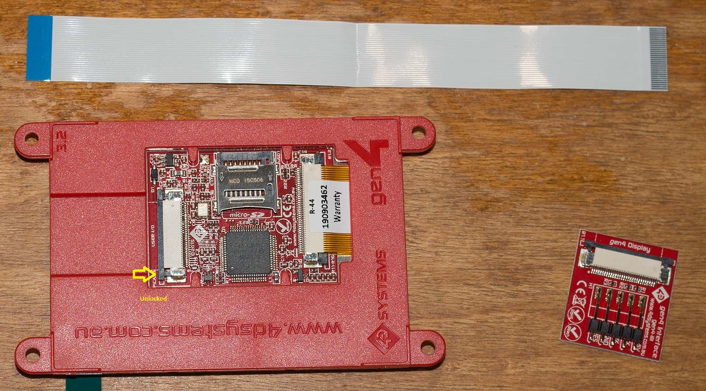
</li>
</li>
<li>When you get the connectors installed correctly and connect it to the programmer and a PC, the
3.2" screen lights up.

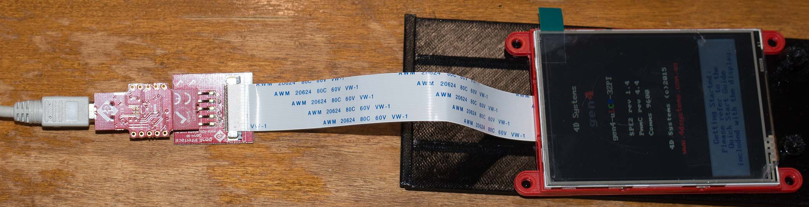
</li>
</li>
<li>A FAT formatted uSD card is installed. The primary partition must be no more than 4GB.
As of this writing, Windows 10 has no simple GUI to accomplish this on larger (and more common)
uSD cards. To limit a partituion to 4GB and FAT format, you must use diskpart run as an administrator, which is <string>dangerous</strong>.
One wrong keystroke and you will destroy your PCs boot drive. <a href='https://superuser.com/questions/202160/how-do-i-format-my-8-gb-usb-drive-to-fat-fat16-in-windows-7#answers'>Here</a> are some instructions. <strong>The dangerous step is the <code>select disk 1</code> command</strong>. You must select the correct disk!
 
Copy the contents of the file WL1244-gen4.zip onto the card.

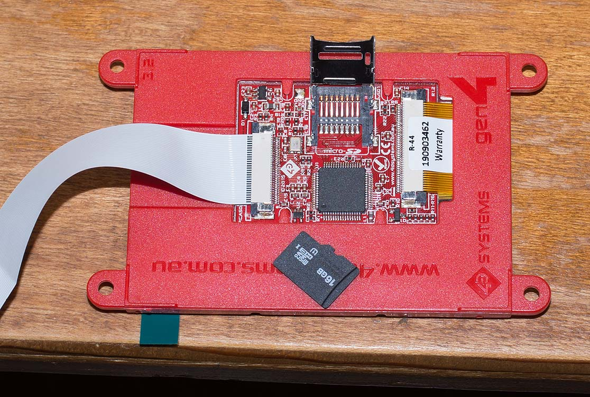
</li>
</li>
<li>Details about the enclosure are <a href=enclosure.md>here</a>.</li>
<li>The enclosure prints with a substantial amount of support material. It is easy to remove, but it helps to know exactly where to grab and twist. See <a href='https://youtu.be/Ue96Qx1N7DY'>this video</a>.</li>
</ul>

Once the PCB is assembled, here is a photograph of the parts (REV 2 device):
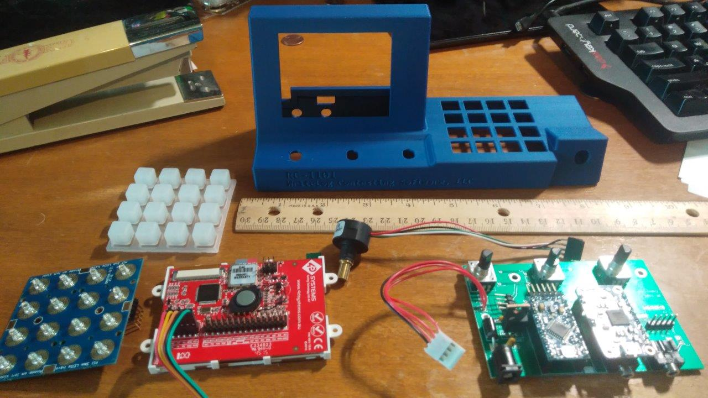

