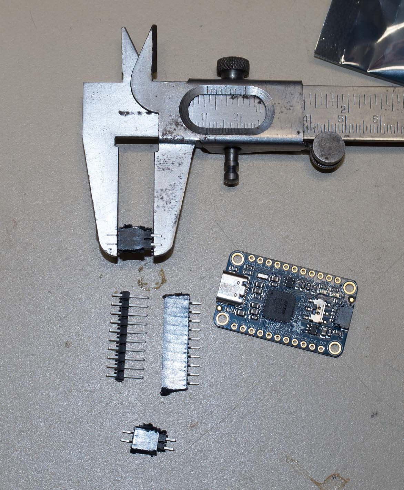
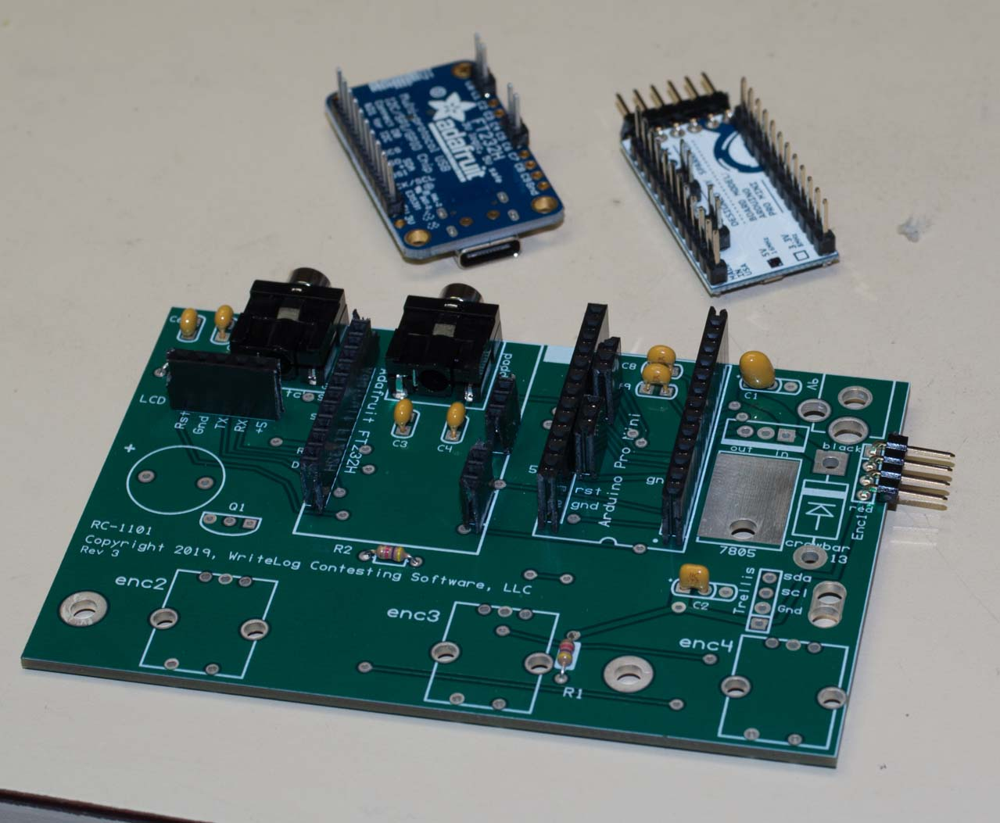

<h3>Parts List</h3>
You are reading the documentation for design that uses the gen4 display device, the gen4-uLCD-32PT. Switch git branches if you have the older uLCD-32PTU device because
it has different mounting dimensions. The parts to build this device, except for the PCB and the enclosure and the machine screws and nuts, are available at digikey. See a PDF of the parts <a href='partslist.pdf'>here</a>. Or link to the digikey shared shopping cart from <a href='https://www.digikey.com/short/z84fb8'>here</a>.

Note that the specified female headers have a 0.29 inch insulation height. This, combined with the 0.10 inch insulation height
on the matching male header, is a critical dimension
for the Adafruit FT232H breakout board. The USB port on that board will not line up with its matching hole in the enclosure otherwise.
Also note that Adafruit has put their same part number, 2264, on both an older version of the board with a micro-USB connector,
and a newer version with a USB-C connector. Both the old an new Adafruit boards will fit this PCB and enclosure, but of course you'll need a different cable.

<h3>Construction hints</h3>
<ul>
<li>Populate the trellis LED array using the instructions on the 
<a href='https://www.adafruit.com/product/1616'>Adafruit website</a>.</li>
<li>Add the right angle 4 pin SMD header. There is only one position it
will work.

Use the 4-pin connector as a spacer to ensure you have room to install it later.

 </li>
<li>Smallest parts go on the PCB first.

</li>
<li>Next in size are the 6mm back panel connectors.

</li>
<li>Cut the headers for the RS232H part to the approppriate number of pins, both the socket side and the pin side. Confirm you have the 
right size. The total offset of the RS232H from the PCB must be 0.390 inches (25/64 inches, or 9.9mm)

</li>
<li>Solder the RS232H break out board top and bottom while inserted. This picture was taken after soldering and pulling it out of the sockets. 

</li>
<li>Rev 3 of the PCB has the flat side of Q1 silkscreened incorrectly.

</li>
</li>
<li>PCB populated. Note that a 5 pin female header must be installed at the LCD header position.

</li>
</li>
<li>The connectors on the 4D systems parts are very small. Look at the photo carefully.
The locking tab slides towards the "gen4 Display" logo to unlock.

</li>

</li>
</li>
<li>When you get the connectors installed correctly and connect it to the programmer and a PC, the
3.2" screen lights up.

</li>
</li>
<li>A FAT formatted uSD card is installed. The primary partition must be no more than 4GB.
Copy the contents of the file WL1244-gen4.zip onto the card.

</li>
</li>
</ul>

Once the PCB is assembled, here is a photograph of the parts (REV 2 device):

