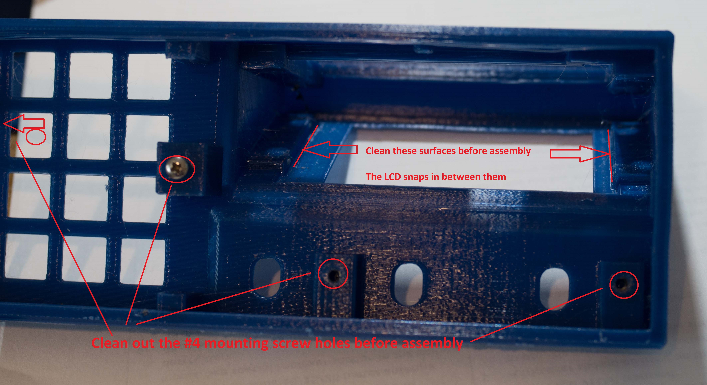
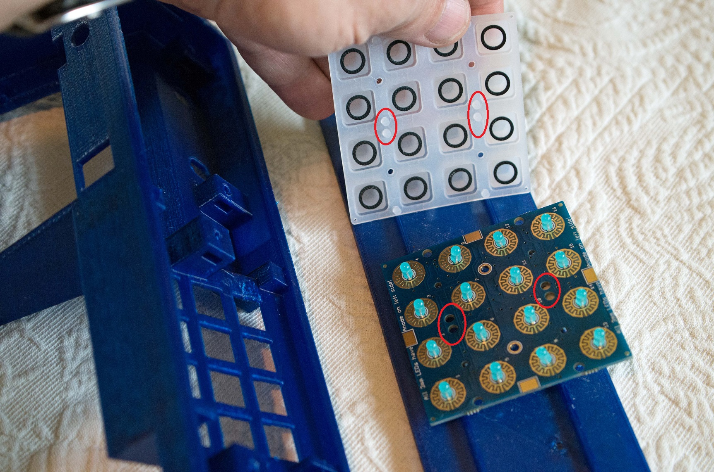

RC-1101 Enclosure
The enclosure is designed with <a href='solidworks.com'>SolidWorks</a>, and the CAD folder is
the SolidWorks design. If you're not going to redesign the enclosure, you
don't need SolidWorks nor what's in the CAD folder. The STL folder contains exported shapes for the enclosures,
<i>almost</i> ready to print on a 3D printer. 
Read the notes below.
The enclosure has these 5 parts to print:
<ol>
	<li>the <a href='STL/enclosure2.STL'>enclosure itself</a>. Do <b>not</b> print this STL file without first 
	understanding exactly what your 3D printer is
       	capable of printing. Do not overlook the cavities
	in the design that accept nuts for #4 and #2 machine screw nuts. Those cavities are very difficult to clean out if your printing
	process fills them with support material. Hints for printing it on low end
	<a href='https://en.wikipedia.org/wiki/Fused_filament_fabrication#Fused_deposition_modeling'>Fused Deposition Modeling</a> (FDM) printers are below.
	<li><a href='STL/enclosure2 LCD back cover.STL'>enclosure2 LCD back cover.STL</a>
	<li><a href='STL/enclosure2 bottom cover.STL'>enclosure2 bottom cover.STL</a>
	<li><a href='STL/BigKnob.STL'>BigKnob.STL</a>
	<li><a href='STL/SmallKnob.STL'>SmallKnob.STL</a> (print quantity three)
</ol>

In the Trellis directory are the designs for the radio-specific
keypad overlays:
<ul>
	<li><a href='STL/Overlay-Generic.STL'>Overlay-Generic</a> keys used when WriteLog has no specific driver
	<li><a href='STL/Overlay-K2.STL'>Overlay-K2</a> for the Elecraft K2
	<li><a href='STL/Overlay-K3.STL'>Overlay-K3</a> for the Elecraft K3
	<li><a href='STL/Overlay-Icom.STL'>Overlay-Icom</a> For Icom radios, about IC-756 and newer.
</ul>
<h3>Enclosure printing hints</h3>
The <a href='STL/enclosure2.STL'>enclosure2.STL</a> is the resulting shape. 
Windows 10 has a viewer for stl. Just click the <a href='STL/enclosure2.STL'>link</a> 
to have a look at it the model. 
On an inexpensive 3D printer, gravity won't let it print in that orientation, and I found I had to model some extra 
supports that break away
after printing. The modeled shape to print on an FDM printer, the one with the orientation that accounts for gravity and
has special supports, is <a href='STL/enclosure42.STL'>enclosure42.STL</a>. 

Printing this enclosure is not a beginner 3D printing project. It takes a total above 18 hours to print the three of them on my 
<a href='http://prusa3d.com'>prusa I3 MK2S</a> printer. 

I used <a href='http://slic3r.org'>Slic3r</a> for the slicer. The slicer parameters <b>are</b> important for 
the main enclosure. In particular:

<ol>
	<li>Generate support material is <b>on</b>.</li>
	<li>Overhang threshold of <b>20</b> degrees.</li>
	<li>Support on build plate is <b>on</b>.</li>
	<li>I used the support material options <code>Rectilinear grid</code> with pattern spacing of 2.5 mm.</li>
        <li>I used a Brim width of 2mm. </li>
        <li><a href='STL/enclosure2support.STL'>enclosure2support.STL</a> is designed to be a Slic3r "support enforcer". Using it adds supporting
material to left and right edges of the print.
</li>
</ol>

The six items listed here are for printing main enclosure only. The overlays, and the back and bottom covers can
be printed with default Slic3r settings. The first 3 items in the list are critical. Item (4) 
was the result of experiments that seemed marginally better than the default settings. Items (5) and (6) 
are to reduce warping. The front bottom edge of the enclosure is the first bit to print
and getting it really stuck to the build plate reduces warping. Instead of Brim width, I also tried
a Raft (because the support material Slic3r lays down is wider than the edge itself) but seemed
to get a better result with Brim. The enclosure2support.STL keeps the left/right edges from wobbling
from the beginning until the print reaches the back edge of the enclosure.

I used PETG material for prints destined to actually be used for a device. I used PLA for test prints to 
confirm geometry. 
<h3>The overlays</h3>

The Trellis keyboard overlays are designed to be printed lettering up with a filament color change anywhere
between Z coordinate above 1.8mm.
 I print the overlays with either PLA or PETG filament depending on the color scheme
I want. PETG is the choice when I want the overlay to match the color of its mating enclosure, but PLA is just
easier to deal with, so its a choice for the case you want the overlay printed in a contrasting color.
<h3>Knobs</h3>
All four knobs are for press fit onto a shaft size of 6mm. The 3D printer generally leaves a little debris that can be cleaned out using an undersized drill bit in a bare hand. Rotate the drill bit in the knob's hole while scraping it against all the sides. I used size 13/64 inch.
<h3>Assembly</h3>

Fully assemble the two printed circuit boards. 

Instructions for the Adafruit Trellis are
<a href='https://learn.adafruit.com/adafruit-trellis-diy-open-source-led-keypad/adding-leds'>here</a>.

The custom 3.5 inch by 2.8 inch printed circuit board is all through-hole components. We don't
offer step-by-step kit instructions, but here is an order of assembly that accommodates being able to
place the through-hole components and solder them without them falling out (much):

<ul>
<li>Install a right angle male header at enc-1. The pins extend out beyond the edge of the PCB.
	<li>the two 1/8" mini jacks, J2 and J2.
	<li>Assemble the two 12 pin, .1" centered female connection headers for U2, and their corresponding
       12 pin male connection headers. Don't solder yet.
       <li>Add the two 2 pin headers, both male and female, for the A6/A7 and SDA/SCL pins for U1.
       <li>Solder <i><b>only</b></i> the four corner pins (D1, D9, D10 and RAW) on both the top of the Arduino board
and the bottom of the PCB. double check that all pins are aligned and pushed all the way in. 
Triple check. Its much more difficult to correct errors after this.
<li>Now solder all U2 pins on the top of the Arduino and the bottom of the PCB.
<li>With the Arduino pulled out of its PCB socket, install a right angle male 6 pin programming header. <b>Important:</b> The header <b><i>must hang from the bottom of the Arduino board</i></b>. It will not clear the enclosure if mounted on top.
<li>Use a similar procedure for U1. It has 10 pin headers--a female and a male--and has to be soldered
on top of the Adafruit FT232H board and on the bottom of the PCB. Solder the four corners first.
Double check that all the pins are populated and pushed all the way in.
<li>triple check. you won't get another chance. Now solder all the pins for U1.
<li>Install male headers at J5 (5 pins) and J6 (2 pins)
<li>Install the J15 power jack.
<li>U14 has 3 leads that extend through the board and its TO-220 package <b>must</b> be bent over 
with the hole on its tab matching the hole in the PCB. It dissipates about 2W and will 
overheat if not bonded properly to the PCB.
<li>put a very small dot of heat sink grease on U14 to thermally bond it to the matching PCB
area with no solder mask.
<li>Fasten it with a 4-40x1/4" screw and #4 nut. 
<li>All the resistors R1 through R5 are the same value, 4.7K
<li>The power supply has the large diode D13, the polarized 1.0 uF capacitor C1 and the 5V output, 0.047 uF, C2.
<li>C3, C4, C5, C6, C8, C9 are all .001uF
<li>C7 and C10 are .1uF (may be omitted as CW paddle sidetone is not in the firmware.)
<li>Install a 4 pin female connector on the leads from the panel mount optical encoder.
Observe the color designations on the PCB. The black wire goes into pin 1.
Don't shorten the encoder wires. Press their
stripped ends into the connector housing with a small allen key or similar tool.
<li>Solder 4 wires of about 4 inches length and 24 gauge in the J4 holes labeled Trellis.
I use three wires the same color and a distinct color for 5V.  
<li>Assemble the 4 wires from J4 into a 4 pin female header. Maintain the same order as on
the PCB. Pin 1 on the header (use a magnifying glass) is the 5V pin.
<li>Orient the Trellis board with its lettering upright in front of you, and with its bottom
up (with its IC up.)
<li>Solder a 4 pin male SMD header onto the trellis board on the <b>bottom</b> edge of the Trellis board
(the edge <b>closest</b> you) with the 4 pins spanning the SDA through the 5V pads and nothing
on the (unused) INT pad. The header's male pins are directed back at the board's IC (away
from you.) Only solder the two end pads first (5V and SDA).
<li>Connect the header on the wires from J4 to the Trellis SMD header to confirm you have
clearance for the connectors to mate. Then finish soldering the SMD header to the trellis.
<li>Use two nylon cable ties to bind the 4 wires together on each of the 4-wire harnesses:
the one to the
Trellis and the one to the panel mount encoder.
<li>Last, install the 3 PCB mount encoders. solder all the pins. There will be significant
force trying to pull these back out of the board in the future if and when it becomes necessary to remove
the knobs pressed on them.
</ul>

<h3>Enlosure Cleanup</h3>

The 3D printing process can leave debris that makes it difficult or impossible to assemble. This
is especially true of the mounting of the LCD. Be sure to use a flat blade screwdriver to
scrape any debris off the surfaces indicated in the photo. Also push a #4 machine screw 
through the 4 mouting holes to clear them as well. Wiggle a small hex key in the nut
slots to loosen the debris.

<h3>Final assembly</h3>
The elastomer pad for the <a href='https://learn.adafruit.com/adafruit-trellis-diy-open-source-led-keypad'>trellis</a> is square, but only two of its possible four orientations lines up its feet into the corresponding holes on its PCB. See this illustration. 

